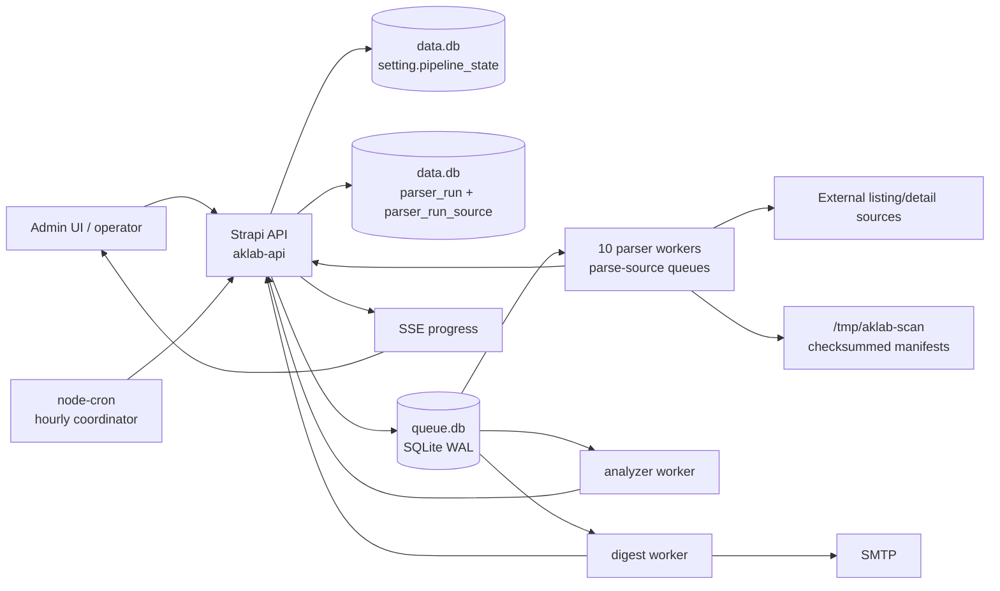
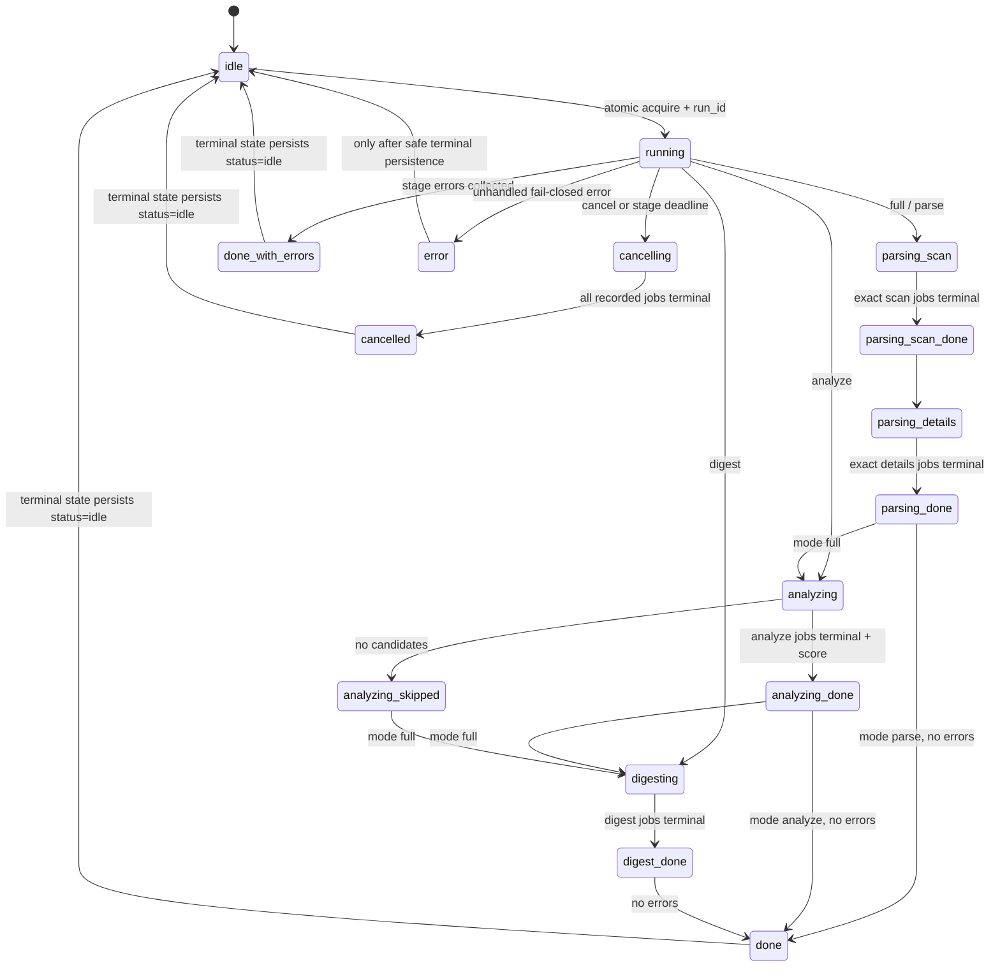
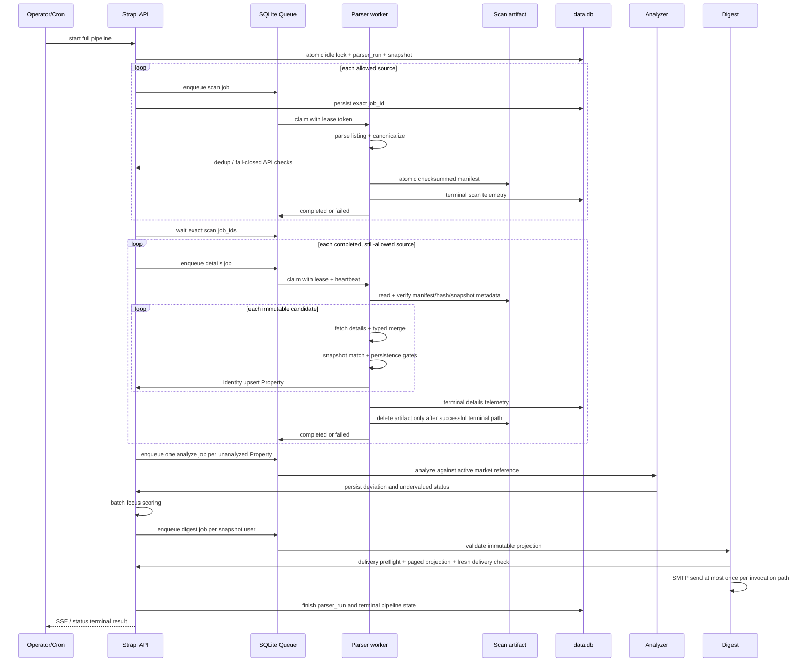

# Архитектура парсеров и полного pipeline AKLAB

> **Статус:** фактическая архитектура релиза `v1.1.93`.
> **Назначение:** единая карта runtime-потока, контрактов данных, проверок и stop-условий.
> **Граница:** документ описывает код и эксплуатационные инварианты. Он не является разрешением на deploy, cleanup, canary или новый scan.

## 1. Коротко: что делает система

AKLAB запускает один run-scoped pipeline:

```text
immutable user snapshot
  → scan всех разрешённых источников
  → immutable scan artifacts
  → details + окончательная фильтрация + upsert Property
  → анализ цены и focus score
  → immutable digest projection + отправка
  → terminal state и acceptance
```

Главные свойства:

- одновременно допускается только один pipeline/canary lifecycle;
- каждый запуск получает неизменяемый `run_id` и snapshot пользовательских фильтров;
- scan и details выполняются отдельными jobs для каждого источника;
- ожидание и отмена привязаны к точным `job_ids`, а не к «пустой очереди вообще»;
- долгие jobs защищены lease token и heartbeat;
- geography проходит только через typed `property_location`;
- отсутствие доверенного адреса/региона приводит к fail-closed skip, а не к угадыванию;
- item-level detail failures могут дать source `degraded`, не обрывая весь источник;
- source-wide failure, повреждённый artifact, потеря lease или ошибка persistence остаются fail-closed;
- `done` означает отсутствие stage/queue errors, но не заменяет проверку source telemetry.

## 2. Runtime topology



### 2.1 Процессы

`services/services.json` является source of truth для PM2 topology:

- core: `aklab-api`, `aklab-app`;
- parser workers: 10 процессов;
- workers: analyzer, digest, photo-fetcher;
- `parser-aggregator-bankrot` имеет отдельный declarative memory limit `1024M`;
- остальные parser workers используют общий стандартный лимит из PM2-конфигурации.

Каждый parser process слушает собственную очередь `parse-<source>`. Shared worker стартует с `concurrency=2`, но pipeline создаёт не более одной scan и затем одной details job на источник в рамках одного run.

### 2.2 Активные parser services

| Source slug | Основной транспорт | Details | Особый runtime-контракт |
|---|---|---:|---|
| `aggregator-bankrot` | Playwright | да | long workload; отдельный PM2 memory limit |
| `alfalot` | Playwright SPA | да | ожидание hydrated property fields |
| `etprf` | Playwright | да | property rows отделены от organizer fields |
| `fabrikant` | Playwright / Next.js | да | load-more и ожидание card hydration |
| `invest-mosreg` | JSON API | нет | listing-only typed payload |
| `investmoscow` | SSR/Nuxt JSON | нет | listing-only SSR payload |
| `m-ets` | Playwright | да | `minimum_price` разрешён только из подтверждённого source field |
| `roseltorg` | Playwright | да | текущая geography fail-closed; source может быть `success_empty` |
| `sberbank-ast` | Playwright + XML | да | browser возвращает raw serializable fields; Node helpers вызываются вне `page.evaluate()` |
| `torgi-gov` | Node `fetch`, JSON API | да | declared Russian CA chain; adaptive bounded retry |

`parser-fedresurs` присутствует в репозитории, но отсутствует в `services/services.json`; он не является частью зарегистрированной десятипроцессной parser topology. DB activation и наличие package сами по себе не доказывают наличие runtime worker.

Детальные source-specific geography contracts находятся в [parser-source-contracts.md](parser-source-contracts.md).

## 3. Entry points и расписание

### 3.1 Ручной pipeline

Authenticated admin вызывает `POST /api/pipeline/start` с mode:

- `full`: parse → analyze → digest;
- `parse`: только parse;
- `analyze`: только analyze;
- `digest`: только digest.

Manual run обязан иметь положительный `targetUserId`; snapshot строится для одного активного пользователя с готовым профилем.

Legacy `POST /api/cron/parse/:slug` создаёт одну combined source job без run snapshot. Он запрещён, пока lifecycle не `idle`, и не является частью normal full pipeline.

### 3.2 Автоматический pipeline

API регистрирует два hourly coordinators в `Europe/Moscow`:

- parser canary — за 3 часа до `setting.digest_time`;
- full pipeline — в час `setting.digest_time`.

Coordinator проверяет час раз в час. Per-source cron больше не используется. Cleanup истёкших аукционов в `03:15 MSK` — отдельная DB operation и не является parser scan.

### 3.3 Canary — отдельный lifecycle

Canary не входит в full pipeline:

- атомарно занимает тот же idle lock;
- создаёт по одной `operation=probe` job на активный source;
- ограничивает sample `1..3` объектами и `maxAttempts=1`;
- не создаёт Property, не запускает analyze/digest;
- делает реальные listing/detail requests, поэтому это всё равно scan activity;
- требует отдельного operational approval, если runbook или текущий режим запрещает новые запросы.

## 4. Lifecycle и state machine



В `setting.pipeline_state` terminal stage (`done`, `done_with_errors`, `cancelled`, `error`) хранится вместе со `status=idle`. То есть UI и acceptance должны читать оба поля.

### 4.1 Lock acquisition

1. API проверяет in-memory `activeRunId`.
2. `tryAcquireIdleState()` выполняет conditional SQLite `UPDATE ... WHERE pipeline_state.status='idle' RETURNING id`.
3. Победитель получает UUID `run_id`, initial stage и durable state.
4. Создаётся `parser-run` telemetry row.
5. Только после этого строится immutable filter snapshot.

Если durable state или telemetry нельзя записать, lifecycle не освобождается оптимистично. Неопределённое состояние блокирует новый run до operator recovery.

### 4.2 Restart recovery

Если API стартует при persisted `running/cancelling`:

- он не сбрасывает state в idle;
- проверяет сохранённые `run_id` и `job_ids`;
- запрашивает cancellation только для live jobs этого run;
- ждёт terminal status каждой записанной job;
- missing job сохраняет blocking state вместо ложного завершения.

## 5. Immutable filter snapshot

До первой queue job pipeline строит snapshot версии 1:

```text
schemaVersion, scope, createdAt, windowEndAt,
profiles[], SHA-256 hash
```

В snapshot входят только allowlisted profile fields:

- user/profile/version identifiers;
- regions и property types;
- price/area ranges;
- stop words.

Email и другие PII в parser snapshot не входят.

Правила matching:

- ограничения внутри одного профиля объединяются через **AND**;
- готовые профили объединяются через **OR**;
- invalid snapshot/hash всегда fail-closed;
- scan пропускает неизвестные ещё поля, чтобы details могли их дополнить;
- details повторно применяет тот же snapshot к полному candidate;
- изменение пользовательского профиля во время run не меняет scope уже запущенного pipeline.

Если готовых профилей нет, run завершается успешным no-op без parser jobs.

## 6. Полный sequence flow



## 7. Queue contract

### 7.1 Storage and claiming

Все процессы используют один `queue.db` в SQLite WAL mode. Job содержит:

- queue/status/data/result/error;
- attempts/max_attempts;
- correlation ID и отдельный idempotency key;
- worker/lease token;
- lease expiry, persisted lease duration и heartbeat;
- cancellation marker.

Claim выполняется одним atomic `UPDATE ... RETURNING`. Completion/failure разрешены только владельцу текущего lease token.

### 7.2 Idempotency

Partial unique index запрещает две `pending/active` jobs с одинаковыми `(queue, idempotency_key)`.

Pipeline keys:

```text
{runId}:{source}:scan
{runId}:{source}:details
{runId}:{documentId}:analyze
digest:{runId}:{userId}
```

`correlation_id` служит trace field и не заменяет idempotency key.

### 7.3 Heartbeat, retry и stale recovery

- default lease: `QUEUE_STALE_TIMEOUT_MIN`, обычно 5 минут;
- worker heartbeat: примерно половина lease duration;
- transient handler error: до `max_attempts` с exponential queue backoff;
- `PermanentError`: terminal failure без queue retry;
- stale active job с живым retry budget возвращается в pending;
- stale job с исчерпанным budget становится failed;
- stale cancelled job становится terminal cancelled.

Важно различать два retry уровня:

1. **queue retry** повторяет целую source stage job;
2. **adapter retry** повторяет один bounded HTTP request внутри job.

Например, Torgi `v1.1.93` использует максимум 5 request attempts, timeout 30 секунд на attempt, pauses `5/15/30/60s`, numeric `Retry-After` с cap 120 секунд и 15-секундный cooldown после восстановления. Только `429`, `5xx` и network/transient failures ретраятся; permanent `4xx` остаются fail-closed. Это уменьшает вероятность дорогого queue retry, который повторил бы scan с первой страницы.

### 7.4 Cancellation и deadline

Stage timeout по умолчанию — 4 часа. Deadline:

- переводит lifecycle в `cancelling`;
- ставит cancellation marker только точным live jobs текущего run;
- не объявляет stage завершённой до terminal acknowledgement всех jobs.

Перед каждым существенным side effect handlers проверяют cancellation и lease ownership.

## 8. Scan stage

Для каждого `is_active=true` source pipeline допускает normal work только при health `healthy|degraded`. `blocked`, `schema_changed`, unknown/null и malformed health fail-closed.

Worker выполняет:

1. validation snapshot и его hash;
2. source health re-read;
3. reset source progress counters;
4. повторный health check;
5. `parser.parse(depth)`;
6. canonical `property_location` validation;
7. identity check `source + external_id`;
8. global technical commercial filter;
9. snapshot OR match на доступных listing fields;
10. smart stop после 10 последовательных дубликатов;
11. atomic scan artifact write;
12. source stats и terminal scan telemetry.

`propertyExists()` fail-closed: API/network/malformed response считается «существует», чтобы сбой identity service не породил дубликаты.

### 8.1 Scan artifact

Artifact schema v2 содержит:

- source и run-scoped artifact ID;
- exact counters;
- immutable candidate array;
- snapshot hash, scope, profile count;
- SHA-256 checksum полного canonical payload.

Write: temporary file → atomic rename.

Read перед details проверяет:

- safe path segments;
- exact schema/keys;
- counters и bounds;
- source/run identity;
- checksum;
- snapshot metadata.

Повреждённый, missing или подменённый artifact — permanent source-stage failure. Artifact удаляется только после успешного details terminal path.

## 9. Details и persistence

### 9.1 Shared browser lifecycle

Для detail-capable parser shared handler пытается создать один Chromium browser и один stealth context на весь source artifact. Каждый adapter открывает/закрывает page. Browser/context закрываются в `finally`.

Если shared browser launch не удался, разрешён adapter-specific fallback. API-first/listing-only adapters не нуждаются в Chromium.

### 9.2 Item flow

Для каждого candidate:

1. проверить cancellation, lease и source health;
2. вызвать `fetchDetails(url, sharedContext)`;
3. принять только typed parser diagnostics;
4. merge `property_location` через общий typed contract;
5. игнорировать loose `address/city/coordinates` без typed location;
6. merge только non-null detail fields;
7. повторно canonicalize location и legacy projections;
8. сделать bounded anti-ban delay;
9. при failed detail request — skip item, не сохранять stale scan data;
10. при `property_location.status=missing` — skip и записать sanitized unresolved manifest;
11. повторно применить immutable user snapshot;
12. извлечь canonical auction deadline, если он однозначен;
13. ещё раз проверить source health и lease;
14. выполнить `createProperty()`.

### 9.3 Geography contract

Единственный источник geography — `PropertyLocation`:

- `confirmed_address`;
- `confirmed_region_only`;
- `missing`.

Legacy `address`, `city`, `latitude`, `longitude` всегда проектируются из typed location. Title, body text, party/organizer/debtor address и первый найденный адрес не могут использоваться как property geography.

### 9.4 Final persistence gates

`createProperty()` повторно проверяет:

- typed geography normalization;
- commercial type;
- legacy rules только для legacy invocation;
- price/area/city constraints;
- положительный `price_per_sqm`;
- identity deduplication;
- DB-backed identity upsert на `(source, external_id)`.

Upsert закрывает check-then-create race: concurrent winner возвращается как duplicate, а не создаёт вторую запись.

### 9.5 Partial detail failures

- Обычная ошибка непосредственно внутри `fetchDetails()` ограничивается одним item.
- Source stage становится `degraded`, если есть и successes, и item failures.
- Если все attempted details failed (`details_ok=0`), source stage fails и остаётся retryable.
- Ошибки typed location, telemetry, merge, progress или persistence не маскируются как item degradation.

## 10. Run-scoped telemetry и source health

### 10.1 Telemetry hierarchy

- `parser-run`: один pipeline run;
- `parser-run-source`: один `{runId}:{source}:{scan|details}`.

Lifecycle source row:

```text
queued → running → success | success_empty | degraded |
blocked | schema_changed | failed | cancelled
```

Terminal counters — один exact snapshot, не incremental patch:

```text
listed, eligible, existing, pre_filtered,
details_attempted, details_ok, created, skipped, failed,
property_block_found, location_label_found,
location_confirmed_address, location_confirmed_region_only,
location_missing, location_unresolved, schema_mismatch
```

Queue terminal state является последним источником истины: pipeline reconciles worker telemetry с фактическим completed/failed/cancelled job.

### 10.2 Health classification

После terminal details API детерминированно классифицирует source:

- `healthy`;
- `degraded`;
- `schema_changed`;
- `blocked`.

Signals включают:

- typed transport/error class;
- zero detail successes;
- наличие property block/location label;
- schema mismatch ratio;
- drop detail success ratio относительно последних healthy baselines;
- рост missing-location ratio;
- canary evidence.

`schema_changed|blocked` — hard quarantine. Normal scan/details/direct parse не могут автоматически снять quarantine; требуется reviewed operational release.

## 11. Analyze и focus scoring

После parsing pipeline выбирает shared Property с `is_undervalued IS NULL` и создаёт отдельную `analyze-property` job на каждый document.

Analyzer:

1. re-fetch Property;
2. находит active MarketReference по exact `city + property_type`;
3. если reference отсутствует, сохраняет analyzed/not-undervalued с deviation 0;
4. рассчитывает:

```text
deviation_percent = (reference_price_per_sqm - actual_price_per_sqm)
                    / reference_price_per_sqm * 100
```

5. сохраняет `is_undervalued` относительно threshold;
6. после terminal всех jobs API запускает batch focus scoring.

Analysis jobs также проверяют cancellation/lease перед каждым side effect.

## 12. Digest

Pipeline ставит одну `digest-send` job на каждого user из immutable snapshot.

Job содержит только:

```text
runId, positive userId, snapshotHash, optional correlationId
```

Worker:

1. валидирует exact allowlist job shape;
2. fresh-read delivery state;
3. читает internal immutable projection страницами по 100;
4. проверяет exact response shape, total/pages/threshold/window consistency;
5. запрещает duplicate document IDs и более 100 000 объектов;
6. при empty projection возвращает safe skip;
7. повторно fresh-read delivery state непосредственно перед SMTP;
8. валидирует `https:` links и HTML-escape scraped values;
9. проверяет cancellation/lease перед send;
10. отправляет email;
11. не делает post-send cancellation check, который мог бы превратить успешный send в retry/double-send;
12. пишет post-send logging best effort.

Pipeline принимает только exact result:

- `{sent:true,count}`;
- `{sent:false,count:0,reason}`.

Malformed result считается digest failure.

## 13. Проверки по стадиям

### 13.1 Acceptance matrix

| Gate | Что проверить | Норма | Stop / investigation condition |
|---|---|---|---|
| Deploy preflight | exact runtime SHA, clean checkout, PM2 process set, API/app health | ожидаемый SHA; все нужные процессы online; API/app отвечают | SHA drift, dirty runtime checkout, missing process, health failure |
| Lifecycle | `run_id`, `status`, `stage`, snapshot hash/scope, exact `job_ids` | один immutable run; `running`; snapshot hash валиден | run ID changed, missing jobs, unreadable state, второй owner |
| Scan queue | status/attempts/heartbeat каждого scan job | jobs terminal; long active jobs heartbeat within lease | stale heartbeat, attempts > 1 без объяснения, missing/duplicate job |
| Scan telemetry | 10 source scan rows, counters, safe status | terminal `success|success_empty`; counters non-negative | source failed/cancelled, impossible counters, unsafe error payload |
| Artifact | schema, identity, metadata, checksum | exact source/run/snapshot match | missing/corrupt/checksum mismatch |
| Details queue | exact details jobs only for completed and still-allowed sources | terminal; heartbeat/lease healthy | quarantine bypass, stale recovery, active job after pipeline terminal |
| Details telemetry | `attempted/ok/failed/created/skipped/location` | counters internally consistent; partial failures explicitly `degraded` | `details_ok=0`, typed schema/location failure, impossible sums |
| Persistence | identity uniqueness, no missing location, positive price/m² | upserted rows satisfy contract; DB integrity OK | duplicates, missing geography persisted, invalid JSON, API 5xx |
| Source health | effective source status and reason | `healthy|degraded` for normal work | `blocked|schema_changed|unknown|null`; stale writer released quarantine |
| Analyze | `analyze_done/total`, queue terminal, market reference path | all jobs terminal; score batch completed | failed/missing job, unanalyzed candidates left by this run |
| Digest | scheduled/sent/skipped/failed and immutable projection | `scheduled = sent + skipped + failed`; `failed=0` | malformed result, projection drift, SMTP failure, duplicate identity |
| Terminal | persisted pipeline and parser-run status | `status=idle`, `stage=done`, `errors=[]` | `done_with_errors`, `error`, `cancelled`, telemetry finalization failure |
| Queue post-run | no pending/active current-run jobs, SQLite integrity | `live_jobs=0`, integrity `ok` | late side effects, stale/pending/active jobs, DB integrity failure |
| Runtime post-run | PM2 safe fields, API/app health | expected processes online; API/app healthy | restarts/OOM, process offline, public/API health regression |
| Canary | отдельный approved bounded probe | all expected source outcomes acceptable | canary skipped unexpectedly, blocked/schema_changed, request ban risk |

### 13.2 Counter invariants

Проверять как минимум:

```text
all counters are safe integers >= 0
eligible = listed - existing - pre_filtered
0 <= details_ok <= details_attempted
0 <= failed <= details_attempted
location_unresolved <= location_missing
location_confirmed_address
  + location_confirmed_region_only
  + location_missing <= details_ok
scheduled = sent + skipped + failed
```

`details_fetched` pipeline и `details_ok` source telemetry имеют разные границы: telemetry считает успешный вызов detail adapter, а pipeline progress агрегирует handler result. Для listing-only adapters `detail_supported=false`, `details_attempted=0`, но details job может создавать Property из listing payload.

### 13.3 Почему `done` недостаточно

`done` подтверждает, что stage orchestration не собрала queue/stage errors. Partial item failures могут корректно завершить source job как completed и source telemetry как `degraded`.

Поэтому final acceptance всегда включает:

1. terminal pipeline state;
2. parent parser-run;
3. все source-stage rows;
4. queue integrity и отсутствие live jobs;
5. DB integrity/data invariants;
6. digest counters;
7. runtime/API/app health;
8. отдельное решение по canary.

## 14. Failure semantics и recovery

| Failure | Поведение | Разрешённое продолжение |
|---|---|---|
| transient single detail item | skip item, source degraded | продолжить immutable artifact |
| all detail items failed | source job failed/retryable | queue retry в bounded budget; artifact сохраняется |
| permanent input/artifact/location error | no retry | terminal failed, investigation |
| 401/403/451/permanent 4xx | fail-closed | не расширять retry и не обходить access policy |
| 429/5xx/network | adapter-specific bounded retry, затем queue policy | остановиться после исчерпания budget |
| lease lost/cancellation | запрет следующего side effect | terminal cancellation/failure reconciliation |
| stage deadline | request cancellation, keep lifecycle lock | ждать terminal acknowledgement |
| API restart mid-run | recover recorded run, cancel/wait exact jobs | не публиковать idle преждевременно |
| source schema drift | `schema_changed`, hard quarantine | sanitized fixture → review → separate release |
| anti-bot/rate-limit block | `blocked`/typed error | прекратить live attempts, cooldown/operational plan |
| terminal telemetry persistence failure | lifecycle remains blocked | operator recovery; новый run запрещён |

Запрещённый recovery:

- global queue clear вместо run-scoped cancellation;
- raw SQL delete/update для «починки» counters или jobs;
- удаление queue/data SQLite;
- force-enable quarantined source;
- TLS verification bypass;
- unbounded retry или повторные full scans для получения красивого результата;
- новый canary/reparse/deploy без отдельного approval.

## 15. Operational checklist полного run

### До запуска

- [ ] exact deployed SHA и release metadata подтверждены;
- [ ] pipeline idle;
- [ ] live parser/analyzer/digest jobs отсутствуют;
- [ ] `PRAGMA integrity_check=ok` для data/queue;
- [ ] все intended sources `is_active=true` и health `healthy|degraded`;
- [ ] API/app health passed;
- [ ] свежие transaction-consistent backups созданы и проверены;
- [ ] cleanup, если нужен, выполнен только штатным protected endpoint;
- [ ] scope/depth/target user и запрет/разрешение canary зафиксированы.

### Во время scan/details

- [ ] отслеживается exact `run_id`;
- [ ] jobs принадлежат этому run;
- [ ] attempts и heartbeat не показывают overlap/stale recovery;
- [ ] aggregator memory/restart count стабильны;
- [ ] source terminal telemetry собирается по мере завершения;
- [ ] transport retries bounded и не обходят permanent errors;
- [ ] цикл не отменяется только из-за долгого, но здорового heartbeat.

### После terminal

- [ ] `status=idle`, `stage=done`, `errors=[]`;
- [ ] все recorded jobs terminal;
- [ ] `live_jobs=0`;
- [ ] data/queue integrity `ok`;
- [ ] source scan/details counters и health классифицированы;
- [ ] analyze counters полностью сошлись;
- [ ] digest counters сошлись, `digest_failed=0`;
- [ ] API/app/PM2 health passed;
- [ ] canary либо отдельно accepted, либо явно deferred;
- [ ] новые scan не запускаются без следующего approval.

## 16. Observability и безопасное evidence

Разрешено сохранять:

- exact release SHA и run ID;
- job IDs, queue/status/attempts и timestamps;
- source slugs и allowlisted counters;
- controlled error/health classes;
- PM2 `name/status/pid/restarts/cpu/memory`;
- HTTP status health probes;
- DB/queue integrity result и агрегированные counts.

Не сохранять:

- JWT/service tokens/cookies;
- `.env` и PM2 environment dumps;
- raw response bodies/HTML/XML;
- реальные адреса, contacts и party data;
- SMTP recipients;
- raw exceptions, если они могут содержать URL, payload или credentials.

## 17. Ключевые файлы

| Boundary | Файлы |
|---|---|
| Pipeline lifecycle | `api/src/services/pipeline/index.ts`, `state.ts`, `stages.ts` |
| Cron | `api/src/cron/index.ts` |
| Queue | `lib/sqlite-queue/index.ts`, `worker.ts`, `types.ts` |
| Generic parser flow | `services/_shared/src/parse-handler.ts` |
| Artifact | `services/_shared/src/scan-artifact.ts` |
| Filters/snapshot | `lib/parse-rules/src/index.ts`, `api/src/services/user-profile.ts` |
| Property API client | `services/_shared/src/strapi-client.ts` |
| Typed geography | `services/_shared/src/property-location.ts`, `types.ts` |
| Parser probe/canary | `services/_shared/src/parser-probe.ts`, `api/src/services/parser-canary.ts` |
| Telemetry/health | `api/src/services/parser-run-telemetry.ts`, `parser-source-health.ts`, `parser-source-quarantine.ts` |
| Analyzer/focus | `services/analyzer/src/handler.ts`, `api/src/services/focusEngine.ts` |
| Digest | `services/digest/src/handler.ts`, `api/src/services/digest-projection.ts` |
| Runtime topology | `services/services.json`, `ecosystem.config.js` |
| Source details | `docs/parser-source-contracts.md`, `docs/run-scoped-parser-telemetry.md` |
| Recovery | `docs/parser-drift-runbook.md`, `docs/gotchas.md` |

## 18. Архитектурные риски, которые надо помнить

1. **Automatic scan windows.** Canary и full pipeline вычисляются из одного `digest_time`; operational pause должен учитывать оба часа.
2. **Nested retries.** Adapter retry дешевле whole-stage queue retry, но оба budget должны оставаться bounded.
3. **Long source visibility.** Pipeline progress меняется в основном при terminal source jobs; heartbeat/attempts нужны отдельно.
4. **`done` versus degraded source.** Terminal run без stage errors всё ещё может содержать item-level source degradation.
5. **Artifact locality.** Scan artifact хранится в `/tmp`; restart/redeploy между scan и details требует особой осторожности. Missing artifact fail-closed.
6. **Health is an execution gate.** Нельзя считать source status только dashboard metadata.
7. **Listing-only capability.** Нулевой `details_attempted` корректен только при explicit `detail_supported=false`.
8. **Digest is a side effect.** Fresh delivery recheck и отсутствие post-send cancellation check защищают от неверного адресата и double-send.
9. **Public availability is not parser correctness.** PM2 online/HTTP 200 не заменяют source counters, typed diagnostics и queue integrity.
10. **Canary is still traffic.** Он read-only относительно каталога, но создаёт реальные запросы к внешним площадкам и может влиять на rate limits.
